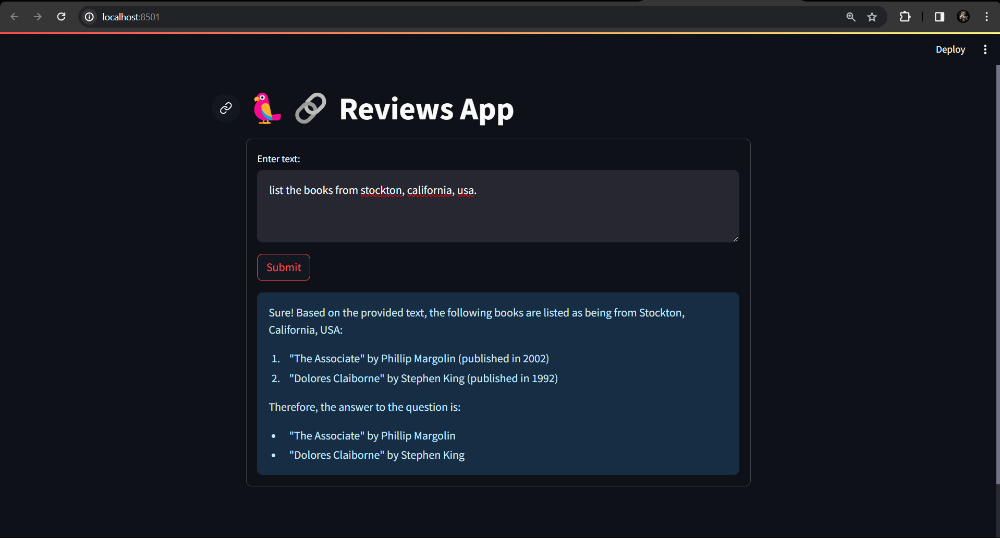

# Offline Retrieval-Augmented Generation (RAG) Application with Ollama, Llama2, FAISS, and Hugging Face Embeddings

This project implements a complete offline RAG application for text generation and retrieval, leveraging efficient local resources. It offers several key advantages:

- **Offline Operation:** Runs entirely without internet connectivity, ideal for scenarios with limited or unreliable network access.
- **Zero Cost:** Utilizes freely available open-source tools, minimizing infrastructure expenses.
- **Ollama with Llama2 LLM:** Employs Ollama for offline execution of the powerful Llama2 large language model, enabling effective text generation.
- **FAISS Vector Database:** Leverages FAISS, a high-performance offline vector database, to efficiently store and retrieve document embeddings.
- **Hugging Face Embeddings:** Integrates pre-trained embeddings from Hugging Face for semantic representation of textual data.


### Getting Started

Run the following commands on your terminal.

Clone this repository.
```
git clone https://github.com/RionDsilvaCS/Reviews-RAG-APP.git
```

Download and pre-process the your own dataset. Apparently in this project the data loader is setup for csv files but you can change it to different dataloaders according to https://python.langchain.com/docs/modules/data_connection/document_loaders/

Install required dependencies (make sure you are inside the git dir)
```
pip install -r requirements.txt
```

Configure project settings make sure you have the ollama running on your device.
https://ollama.com/download
https://ollama.com/library/llama2

Now everthying is ready to be run
```
cd APP
```

```
streamlit run app.py
```



### Key Components:

**Dataset:** The project utilizes the BookCrossing dataset from Kaggle (https://www.kaggle.com/datasets/somnambwl/bookcrossing-dataset). This dataset can be readily downloaded and stored locally.
**Data Preprocessing** Textual data is preprocessed and converted into vector embeddings using Hugging Face Embeddings.
**FAISS Indexing:** The generated embeddings are then indexed within the FAISS vector database for efficient retrieval.


### Offline RAG Pipeline

During runtime, user queries are processed through the following steps:
- **Query Embedding:** The query text is converted into a vector embedding using Hugging Face's models.
- **Document Retrieval:** The FAISS database is queried to find the most relevant documents based on their similarity to the query embedding.
- **Ollama & Llama2 Integration:** The retrieved documents are fed into Ollama, which executes Llama2 to generate a response text that is contextually relevant to the query and retrieved documents.


### Benefits:

- Enables offline text generation and retrieval for various use cases.
- Provides cost-effective and efficient access to large language model capabilities.
- Offers flexibility for customization with different datasets and models.

----
### Follow me

>GitHub [@RionDsilvaCS](https://github.com/RionDsilvaCS)  ·  Linkedin [@Rion Dsilva](https://www.linkedin.com/in/rion-dsilva-043464229/)   ·  Twitter [@Rion_Dsilva_CS](https://twitter.com/rion_dsilva_cs)
